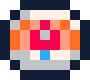

# Dart-07

> A scrolling shooter. As the Dart-07 you fight on Emerald Islands, Outpost in Space, and in the interstellar Phoslar
> Mine

This is a [PICO-8](https://www.lexaloffle.com/pico-8.php) game, which I made
during [Basic Shmup Showcase event](https://itch.io/jam/basic-shmup) organised
by [Lazy Devs Academy](https://www.youtube.com/c/LazyDevs).

You can play it on https://beetrootpaul.itch.io/dart-07 .

⚠️ Please be aware **this game is under development**. Mission 1 is complete and ready to play, but you enter missions 2
and 3 on your own risk 😄

If you want to take a look at the codebase, please visit https://github.com/beetrootpaul/dart-07 (the code inside PICO-8
carts of this game is minified, therefore not suitable for
reading).

1. [Controls](#controls)
1. [Gameplay](#gameplay)
    1. [Power-ups](#power-ups)
    1. [HUD](#hud)
    1. [Recordings](#recordings)
1. [Development](#development)
    1. [Technical Challenges Tackled In This Game](#technical-challenges-tackled-in-this-game)
    1. [How To Develop Further](#how-to-develop-further)
    1. [Code Style](#code-style)
1. [License](#license)
1. [Credits](#credits)
1. [Version History](#version-history)
    1. [v0.2.0](#v020)
    1. [v0.1.0](#v010)

## Controls

Keyboard:

- press & hold `x` to fire
- press `c` to trigger a shockwave (if available)
- press `p` to open the pause menu

Virtual controller (in browser, on a mobile device):

- press & hold `❎` to fire
- press `🅾️` to trigger a shockwave (if available)
- press `➖` to open the pause menu

Physical game controllers are supposed to work as well, even in a browser. Button mapping varies between models.

## Gameplay

Your task is to pilot Dart-07 unit in a set of secret missions of increasing difficulty:

- first, you mess with the enemy on **Emerald Islands**
- then you continue to the **Outpost in Space** (⚠️ under development ⚠️)
- in order to reach the interstellar **Phoslar Mine** (⚠️ under development ⚠️) and prevent the enemy from utilizing
  that precious resource

Destroy enemies along the way to increase your score, grab power-ups left by them and survive a boss fight in order to
complete a mission.

### Power-ups

There are 4 types of power-ups you can grab, each of them either makes your life easier or, if cannot improve further,
increases your score:

- </img>
  **+1 heart** – you can have max 10 hearts; you lose one whenever you take damage
- </img>
  **fast movement** – increases player's movement speed; does not accumulate; lost on a
  damage
- </img>
  **fast shoot** – increases shooting speed; does not accumulate, but can be combined with the triple shoot; lost on a
  damage
- </img>
  **triple shoot** – you shoot 3 bullets instead of 1, but on a little but slower rate; does not accumulate, but can be
  combined with the fast shoot; lost on a damage
- </img>
  **shockwave charge** – allows you to trigger a destructive shockwave around you (with use of "c" / "🅾️" button); you
  can have max 4 shockwave charges

### HUD

In your HUD you see:

- left-top: **mission progression** (the higher the ship's icon is placed, the close to the boss you are)
- right-top: **your score**, which you gain by destroying enemies and grabbing power-ups in case they cannot bring any
  improvement
- right-middle: **power-ups** you gathered (excluding hearts and shockwave charges)
- left-bottom: **hearts left**; you die when all hearts are gone
- right-bottom: **shockwave charges left**; you can trigger a shockwave if you have at least 1 charge left
- top-middle, during boss fight: **boss' health** (yes, you are supposed to bring it down to zero 😉)

</img>

### Recordings

</img>
</img>
</img>

## Development

### Technical Challenges Tackled In This Game

In this game I focused on learning various bits of [PICO-8 API](https://www.lexaloffle.com/dl/docs/pico-8_manual.html).

Some of the topics I tackled in this game are:

- **multi-cart setup**: this game consists of many carts – 1 main cart for the title screen etc., and 1 cart for each
  mission. Each
  mission has its own sprites and music, as well as a code responsible for available enemy types, including their attack
  and movement patterns. Common SFXs and sprites are copied from the main cart to missions carts with use
  of [MEMCPY](https://www.lexaloffle.com/dl/docs/pico-8_manual.html#MEMCPY) and a user data memory
  area (`0x4300-0x55ff`), preserved
  across loaded carts). Moreover, I implemented this in a way which allows me to use same codebase to load both locally
  developed carts as well as those published
  to [Lexaloffle BBS](https://www.lexaloffle.com/bbs/?cat=7&carts_tab=1#mode=carts&sub=2).
- **missions defined as a map** – level shape and enemy pattern are defined as sprites in a PICO-8 map, but in a
  simplified form (in order to fit all needed data there). Dedicated piece of code is responsible for translating
  sprites from map into a mission gameplay, including proper placement of edge land/structure tiles.
- **circular clipping**: during shockwave a ring of inverted colors propagates from the player. To achieve that I had to
  learn how to implement [circular clipping masks](https://www.lexaloffle.com/bbs/?tid=46286) in a CPU-performant way.
- **dithered fade-in/out transition**: basically a set of rectangles filled
  with [FILLP](https://www.lexaloffle.com/dl/docs/pico-8_manual.html#FILLP) patterns, moving over screen.
- **high score**: usage of PICO-8's API to read and store data persisted on a host machine
- **code minification**: with my code style (full of spaces and long names), I found it easy to hit PICO-8's characters'
  count limit. Therefore [I forked and modified luamin tool](https://github.com/beetrootpaul/luamin) and incorporated it
  into this game's build flow, resulting with characters' count reduced by around 50%.

### How To Develop Further

PICO-8 version used to develop this game: `0.2.5c`

Quick start:

1. (optional) Install [nvm](https://github.com/nvm-sh/nvm)
2. (optional) Run `nvm install` to setup proper Node.js version
3. (once) Run `npm install` to download dependencies
4. Run `npm start` to start a watcher which generates minified Lua sources for
   the game every time a file is changed. Please be aware all files has to be
   included (`#include`) manually in the cart's Lua itself.
5. Start PICO-8 and load [dart-07.p8](dart-07.p8) cart

Optionally, to build without minification: `npm run watch-and-build-as-is`

To build dist packages:

- remove cart data file from PICO-8 cart data folder (as set in `$HOME/Library/Application Support/pico-8/config.txt`)
- then run `npm run dist`

To update the sprite sheet of, for example, mission 1:

- edit `graphics/spritesheet_mission_1.aseprite` in Aseprite (please remember you have to use official standard 16
  PICO-8 colours so they will match on import)
- export to PNG with scale 100%
- load cart and run `import graphics/spritesheet_mission_1.png` or `import dart-07/graphics/spritesheet_mission_1.png` (
  depends on what your current working directory is)

### Code Style

This game is made with PICO-8, which imposes a token count limit
(which can be checked in console with `info` command).
It means, in a lot of situations a code clarity had to be sacrificed
in order to squeeze one more enemy or to implement a high score feature `¯\_(ツ)_/¯`

## License

I release this game under MIT license for sake of simplicity and to allow people learn from it.

But, aside from that (therefore I cannot enforce it on you 🙃), if you find this repository useful or use it publicly in
any way, I would be happy to see myself credited. You can found my social media profiles etc. on http://beetrootpaul.com
, or just link to that webpage 🙂

## Credits

I implemented this game on my own, as well as drawn all sprites and composed all SFXs and music. But there are some
resources I found super useful and used some of them I used in the codebase as well. With huge thanks, here are those:

- `#easingcheatsheet` cart by [ValerADHD](https://www.lexaloffle.com/bbs/?uid=47278) with copy-paste ready easing
  functions. See: https://www.lexaloffle.com/bbs/?tid=40577
- [Circular Clipping Masks tutorial](https://www.lexaloffle.com/bbs/?tid=46286)
  by [Krystman](https://www.lexaloffle.com/bbs/?uid=16423)
- [Lua minification tool `luamin`](https://github.com/mathiasbynens/luamin)
  by [Mathias Bynens](https://github.com/mathiasbynens)
- [Pico-8 Music Tutorials](https://www.youtube.com/watch?v=nwFcitLtCsA&list=PLur95ujyAigsqZR1aNTrVGAvXD7EqywdS)
  by [Gruber](https://www.youtube.com/c/Gruber_Music)

## Version History

### v0.2.0

- new powerup type: fast movement
- fixed diagonal speed of a player's ship by dividing it by `1.41`
- fast movement, fast shoot, and triple shoot have their status visible in a HUD
- more health for mission 1 boss and mission 1 big enemy
- shake camera on a shockwave trigger
- lower volume of player shooting
- show a win screen after first mission (the completed one)
- print version number on a title screen

### v0.1.0

- complete game mechanics
- complete mission 1
- complete screens outside missions (but without music for a win screen after mission 3)
- implemented persisted high score
